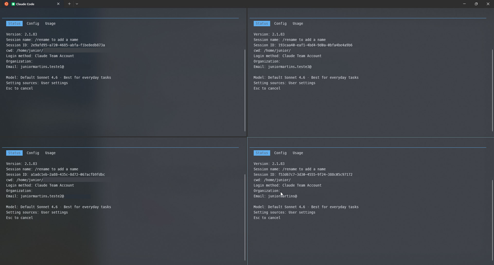

# 🎭 cloak

> **Per-directory profile manager for LLM CLIs** — isolate credentials, contexts and identities per project with zero friction.

[English](README.md) | [Português](README.pt-br.md)

[](https://www.rust-lang.org/)
[](LICENSE)


---

## The Problem

You work with multiple accounts at once — a work account for `claude`, a personal one for `codex`, maybe a client's API key for a specific repo. But both CLIs keep their auth state **globally** in a single home directory.

Switching contexts means manually exporting environment variables, moving config files or praying you didn't leak the wrong key into the wrong project.

**cloak solves this cleanly.**

---

## How It Works

`cloak` resolves the right profile for the current directory by walking up the filesystem looking for a `.cloak` file, then sets the appropriate environment variable (`CLAUDE_CONFIG_DIR`, `CODEX_HOME`, etc.) **before** handing control over to the real CLI via `exec(2)`.

```text
~/repos/
├── company-api/        ← .cloak (profile = "work")
│   └── ...                 └─► CLAUDE_CONFIG_DIR → ~/.config/cloak/profiles/work/claude
│
└── side-project/       ← .cloak (profile = "personal")
    └── ...                  └─► CLAUDE_CONFIG_DIR → ~/.config/cloak/profiles/personal/claude
```

No wrappers running in background. No daemons. No persistent state. Just a clean `exec` replacing the current process.

---

## Features

| Feature | Description |
| --- | --- |
| 📁 **Directory-scoped profiles** | `.cloak` files bind repos to named profiles |
| 🔗 **Zero-overhead exec** | Profile resolved → env set → `exec(2)` the real binary |
| 🔒 **Credential isolation** | Conflicting env vars (e.g. `ANTHROPIC_API_KEY`) are stripped before exec |
| 🔍 **Automatic resolution** | Walks up to root; falls back to `default_profile` from config |
| 👤 **Account inspection** | Shows which account each CLI profile appears to be authenticated with |
| 🩺 **Doctor command** | Validates config, binaries, profile structure and credential hints |
| 💻 **Shell completions** | Bash, Zsh, Fish, PowerShell and Elvish |
| 🖥️ **Claude statusline** | Auto-provisions a statusline script showing model/context/cost and persisting limit snapshots |
| 🔌 **MCP install helper** | Installs MCP servers through the native CLI syntax for supported tools and scopes them per profile |

---

## Full Docs

Detailed documentation is available in [`docs/`](./docs/README.md):

- usage and workflows
- configuration and profile model
- Claude statusline provisioning
- architecture and development
- troubleshooting
- Portuguese (Brazil) translation: [`docs/pt-br/`](./docs/pt-br/README.md)

---

## Install

```bash
# From source
cargo install --path .

# Development
cargo run -- <command>
```

---

## Quick Start

```bash
# 1. Create profiles
cloak profile create work
cloak profile create personal

# 2. Bind a repo to a profile
cd ~/repos/company-api
cloak use work

# 3. Add shell aliases
alias claude='cloak exec claude'
alias codex='cloak exec codex'
alias gemini='cloak exec gemini'

# 4. Auth once per profile — cloak routes the CLI automatically
cd ~/repos/company-api && claude   # ← uses "work" profile
cd ~/side-project      && claude   # ← uses "personal" profile

# 5. Inspect current context
cloak profile show
cloak profile account work
cloak limits work
cloak limits rank

# 6. Install MCP servers in-profile
cloak mcp install codex filesystem --profile work -- npx @modelcontextprotocol/server-filesystem /tmp
cloak mcp install claude sentry --profile work --transport http --url https://mcp.sentry.dev/mcp -H "Authorization: Bearer token"
```

`cloak profile account <name>` inspects each configured CLI home inside the profile and prints the
best local identity hint it can find:

- `claude`: reads `.credentials.json`; shows email/name when present, otherwise reports that
  credentials exist and may include the detected plan.
- `codex`: reads `auth.json`; prefers the decoded `id_token`, then falls back to `account_id` or an
  API-key hint.
- `gemini`: reads `gemini/.gemini/oauth_creds.json`, `gemini/.gemini/.env`, and
  `gemini/.gemini/settings.json`.
- other configured CLIs: if their profile directory is non-empty, `cloak` reports that credentials
  exist but that the CLI is not yet specifically supported.

Example output:

```text
Profile 'work'
claude -> credentials detected, but account identifier unavailable (plan: max)
codex -> Jane Doe <jane@example.com>
gemini -> Gem User <gem@example.com>
```

`cloak limits [name]` reads the latest local limit snapshots. If you omit the profile name, it displays limits for all profiles:

- `claude`: reads `claude/usage-limits.json`, which is populated by the default Claude statusline
  script after Claude receives at least one response in that profile. It shows the latest 5-hour
  and 7-day subscription usage percentages, dynamic pacing (%/h or %/d) based on remaining time,
  plus reset timestamps. To refresh missing or expired data, open or continue Claude in that
  profile and wait for a response; no separate `/usage` step is required.
- `codex`: reads the newest `token_count` event under `codex/sessions` and shows the recorded
  usage windows, remaining percentages, pacing rate, and reset timestamps. To refresh missing or
  expired data, open or continue Codex in that profile; no separate `/status` step is required.

`cloak limits rank` uses the weekly snapshot for each profile and now shows a `Snapshot` column.
Fresh snapshots are ranked first; expired snapshots remain visible for reference, but are sorted
after fresh rows and marked with `expired *` in `Resets`.

`cloak mcp install` installs MCP servers inside the selected `cloak` profile, using the native
syntax of each supported CLI instead of a one-size-fits-all wrapper:

- `codex`: maps to `codex mcp add ...`
- `claude`: maps to `claude mcp add ...`
- unsupported CLIs: fail with a clear error instead of guessing

Examples:

```bash
# Codex stdio MCP in one profile
cloak mcp install codex filesystem --profile work -- npx @modelcontextprotocol/server-filesystem /tmp

# Codex HTTP MCP with bearer-token env var
cloak mcp install codex sentry --profile work --transport http --url https://example.com/mcp --bearer-token-env-var SENTRY_TOKEN

# Claude HTTP MCP with headers
cloak mcp install claude sentry --profile work --transport http --url https://mcp.sentry.dev/mcp -H "Authorization: Bearer token"

# Install the same MCP in every existing profile
cloak mcp install codex filesystem --all-profiles -- npx @modelcontextprotocol/server-filesystem /tmp
```

If you omit both `--profile` and `--all-profiles` in an interactive terminal, `cloak` resolves the
current profile first and then asks whether you want to apply the install to all profiles.

---

## Profile Resolution

`cloak` starts from the current directory and walks **up** to filesystem root looking for the nearest `.cloak`:

```toml
# ~/repos/company-api/.cloak
profile = "work"
```

No `.cloak` found? Falls back to `general.default_profile` from `~/.config/cloak/config.toml`.

---

## Configuration

Generated automatically on first run at `~/.config/cloak/config.toml`:

```toml
[general]
default_profile = "personal"

[cli.claude]
binary = "claude"
config_dir_env = "CLAUDE_CONFIG_DIR"
remove_env_vars = ["ANTHROPIC_API_KEY", "ANTHROPIC_AUTH_TOKEN"]

[cli.codex]
binary = "codex"
config_dir_env = "CODEX_HOME"
remove_env_vars = ["OPENAI_API_KEY"]

[cli.gemini]
binary = "gemini"
config_dir_env = "GEMINI_CLI_HOME"
remove_env_vars = ["GEMINI_API_KEY", "GOOGLE_API_KEY"]
```

Adding a new CLI is as simple as adding a new `[cli.<name>]` block.
If your config was created before Gemini support, run `cloak doctor` and accept the optional migration prompt to append missing recommended CLI blocks.

`cloak profile account <name>` iterates over the CLIs configured under `[cli.*]`, so adding a new
block also makes that CLI show up in account inspection output.

For editor-style apps, `config_dir_env` is optional. You can also prepend launch arguments and set
extra environment variables with `{profile_dir}`, `{profile_name}`, and `{cli_name}` placeholders:

```toml
[cli.cursor]
binary = "cursor"
launch_args = ["--user-data-dir", "{profile_dir}", "--extensions-dir", "{profile_dir}/extensions", "--new-window"]

[cli.cursor.extra_env]
CURSOR_USER_DATA_DIR = "{profile_dir}"
CURSOR_EXTENSIONS_DIR = "{profile_dir}/extensions"

[cli.vscode]
binary = "code"
launch_args = ["--user-data-dir", "{profile_dir}", "--extensions-dir", "{profile_dir}/extensions", "--new-window"]
```

That pattern is important for VS Code/Cursor-style editors because a reused GUI instance can keep a
different logged-in account even when `.cloak` resolves the right profile.

On WSL with the Windows `cursor` wrapper (`/mnt/c/.../cursor/resources/app/bin/cursor`), `cloak`
keeps using the normal wrapper so the launch flow still matches `cursor .` and goes through
Remote WSL integration. In that mode it also sets a profile-specific `VSCODE_AGENT_FOLDER`, which
isolates the remote server state (`~/.cursor-server` by default) per `cloak` profile.

Known limitation: this improves state isolation for Cursor/VS Code-style editors, but it does not
guarantee separate extension logins per `cloak` profile. Some extensions, including Codex, may also
use the editor's SecretStorage or the OS keyring/credential store. When that happens, `user-data`,
`extensions-dir`, and `VSCODE_AGENT_FOLDER` isolation may still be insufficient to keep different
accounts separated inside the same editor installation.

---

## Commands

```text
cloak exec <cli> [--profile <name>] [args...]
                                   Resolve profile, set env, strip conflicting vars, exec CLI
cloak use <profile>                Write .cloak in current directory
cloak profile list                 List all profiles
cloak profile account <name>       Show which account each CLI is using inside a profile
cloak limits [name]                Show Claude/Codex usage (omit <name> for all profiles)
cloak limits rank                  Rank profiles by their available weekly limit (grouped by AI)
cloak profile create <name>        Create profile dirs (+ Claude statusline template on Unix)
cloak profile delete <name> [-y]   Delete a profile
cloak profile show                 Show resolved profile and env paths for each CLI
cloak login <cli> [profile]        Run a CLI in profile context for interactive auth
cloak mcp install <cli> <name>     Install an MCP server using the target CLI's native syntax
cloak doctor                       Run health checks
cloak completions <shell>          Print shell completion script
```

`cloak init <profile>` is still supported as a compatibility alias for `cloak use <profile>`.

When using `cloak exec`, pass `--profile <name>` before any forwarded CLI args. Use `--` to
forward an argument like `--profile` to the target CLI itself.

Visual example of the feature in action, launching the CLI with isolated profiles at execution time:



---

## Architecture

```text
src/
├── account.rs    — Per-CLI credential/account inspection helpers
├── main.rs       — CLI entry point, command dispatch (clap + derive)
├── cli.rs        — Argument structs and subcommand definitions
├── config.rs     — Config file parsing and defaults (serde + toml)
├── exec.rs       — Profile resolution + env setup + exec(2) wrapper
├── mcp.rs        — Per-CLI MCP install adapters (`claude` / `codex`)
├── paths.rs      — XDG-compliant path resolution for config/profiles
├── profile.rs    — .cloak resolution and local profile file handling
└── doctor.rs     — Health check diagnostics
```

**Tech stack:** Rust 2021 · `clap` (derive) · `serde`/`toml` · `color-eyre` · `owo-colors` · `which`

---

## Claude Statusline

When you create a profile on Unix, `cloak` provisions a statusline script inside the Claude profile dir:

```json
{
  "statusLine": {
    "type": "command",
    "command": "bash '<profile-claude-dir>/statusline-command.sh'"
  }
}
```

The script reads Claude's stdin JSON, prints a compact line with **model / context tokens / cost**
(requires `jq`), and persists the latest Claude subscription `rate_limits` snapshot to
`usage-limits.json` for `cloak limits`. Existing `settings.json` with a `statusLine` key is
never overwritten.

---

## Security

- `cloak` **never stores or encrypts credentials** — it only redirects config homes.
- Profile and CLI directories are created with **owner-only permissions** (`0700`) on Unix.
- Conflicting env vars are **stripped** before exec so no ambient credential leaks into a session.

---

## Development

```bash
cargo test      # unit + integration tests
cargo fmt       # format
cargo clippy    # lint
```

Integration tests live in `tests/exec_integration.rs` and validate the full `cloak exec` pipeline with a mock binary: env wiring, API key removal and default-profile fallback.

---

## Troubleshooting

### CLI not found

```text
"<binary>" not found in PATH
```

Install the target CLI or set `cli.<name>.binary` in `config.toml`.

### Wrong profile

```bash
cloak profile show   # shows resolved profile + env paths
```

Then check if there's an unexpected `.cloak` higher up in the directory tree.

### Conflict with `direnv`

If `direnv` exports the same env var (`CLAUDE_CONFIG_DIR` / `CODEX_HOME`), last writer wins. Pick one mechanism per CLI.

---

## License

Apache-2.0
